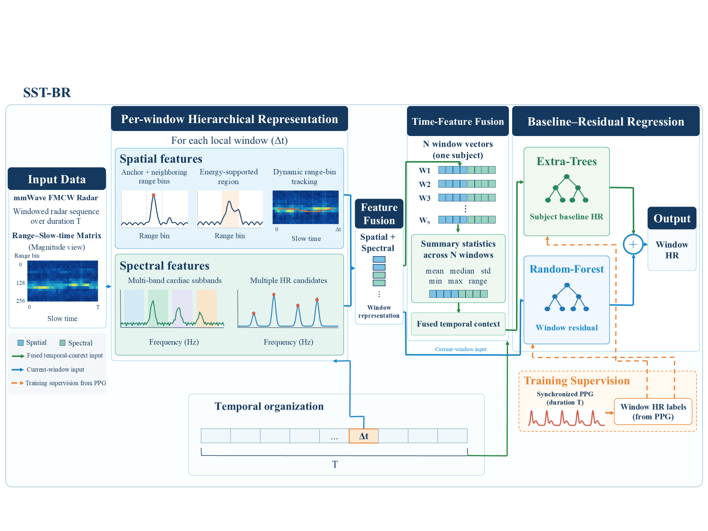

# SST-BR

**Spatial–Spectral–Temporal Baseline–Residual Learning for mmWave Radar Heart-Rate Estimation**

[](https://mybinder.org/v2/gh/TODO-BEFORE-PUBLIC-UPLOAD/sstbr-prepublication/main?labpath=notebooks%2F00_quick_start.ipynb)

## Pre-Publication Executable Release

This repository provides an executable pre-publication demonstration of
SST-BR.

The public release includes the complete data organization, PPG-label
generation, evaluation pipeline, method interfaces, and an interactive Binder
demonstration.

The exact representation and baseline–residual core used to produce the paper
results is temporarily withheld while the manuscript is under review.



## Overview

This is a high-quality structural release, not a broken or obfuscated full
release. The executable path preserves the SST-BR stages and interfaces using
deterministic synthetic signals and the clearly named `DemoCore`.

`DemoCore` is provided only to make the pre-publication Binder executable and
to illustrate the data flow. It is not the implementation used to obtain the
paper results.

## Quick start

```bash
python -m pip install -e .
python scripts/run_demo.py
```

The command completes without private files, network access, or expected
exceptions.

## Method

Radar duration `T` is divided into `N` local windows of duration `Δt`. Each
window follows the visible spatial and spectral stages. Multiple window
representations feed temporal fusion and the baseline branch; the current
window feeds the residual branch. Baseline plus residual yields HR.

The executable demonstration preserves the SST-BR data flow and interfaces,
while the exact representation and regression core used for the reported
results is temporarily withheld during manuscript review.

## Installation and Binder

Pinned Python dependencies are recorded in `requirements.txt` and
`binder/environment.yml`. Binder opens the six-to-eight-cell quick-start
notebook directly. All three notebooks support **Run All** without private data.

```bash
python -m pip install -r requirements.txt
python -m pip install -e . --no-deps
python scripts/verify_installation.py
```

## Evaluation

The public evaluation is complete: two consecutive local predictions are
averaged, then compared with an HR reference estimated directly from the
corresponding 10-second PPG segment. RMSE, MAE, Pearson correlation, and pooled
fold evaluation are included.

Reported manuscript result (not reproduced by this partial demo):

| Scope | RMSE (BPM) | MAE (BPM) | Pearson r |
|---|---:|---:|---:|
| Reported 10-second pooled result | 8.27 | 6.36 | 0.76 |

## Included and withheld

Included: data classes, raw adapters, windowing, PPG labels, visualization,
method-stage contracts, deterministic DemoCore, CLI, notebooks, metrics,
tests, and documentation.

Temporarily withheld: the exact spatial/spectral computations, exact temporal
fusion, exact fitted-regression procedure and parameters, learned models,
feature lists, private caches, and paper-result predictions.

## Repository structure

- `sstbr/data`: complete public data and PPG utilities
- `sstbr/features`, `sstbr/temporal`, `sstbr/models`: transparent stage APIs
- `sstbr/demo_core.py`: executable educational implementation
- `sstbr/evaluation`: complete public evaluation
- `notebooks`: reviewer-oriented Binder walkthroughs
- `tests`: dataflow, API, metrics, demo, and notebook checks

## Citation and license

`CITATION.cff` contains explicit placeholders to complete before public upload;
no venue is claimed. The included public components use the MIT License. If the
authors choose another license, update `LICENSE` and this section before upload.
